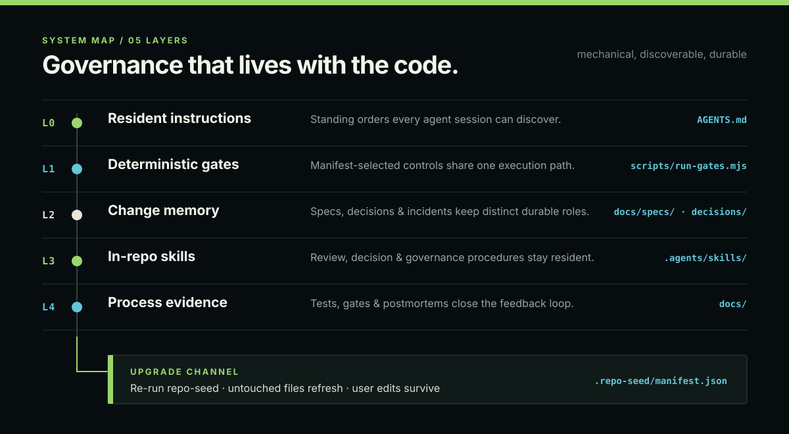

<div align="center">


<h1>repo-seed</h1>

**Make repository governance grow with the code — explicit contracts, durable memory, executable controls.**

`repo-seed` is a cross-tool skill that initializes, audits, adopts, and progressively evolves an **agent-native, self-governing** repository. Deterministic scripts own the mechanics, the model instantiates project knowledge, and a capability manifest keeps the governance layer upgradeable without overwriting user-owned work or duplicating an existing source of truth.

</div>

---

## Why repo-seed

AI assistants are only as good as the context you give them. Most repositories drift: docs rot, decisions get re-litigated, agents re-learn the project every session, and nothing mechanically stops a bad commit.

repo-seed fixes that with **mechanical governance, not more documents**:

- **Agents finally understand your repo** — one `AGENTS.md`, discovered by Claude Code, Codex, Cursor, Gemini CLI, opencode, Copilot & Synergy.
- **Governance skills stay discoverable** — the resident AGENTS router identifies repo-seed management and maps each governance task to the right local or global skill.
- **Intent survives agent handoffs** — risk-boundary work starts from an Approved Spec with permanent evidence.
- **Decisions stop disappearing** — MADR records preserve choices with genuine alternatives without becoming a change log.
- **Research stays traceable** — externally derived implementation keeps its source beside the code or in the owning decision record.
- **Tests earn their keep** — the Core policy maps regression risk to the smallest sufficiently real evidence instead of rewarding test count or coverage theater.
- **Drift gets caught, not noticed late** — a manifest-driven runner gives CLI, CI, and authorized hooks one gate list.
- **Governance grows deliberately** — read-only audits recommend capabilities from repository facts; writes and integrations remain user-authorized.
- **Your work is never overwritten** — the manifest remembers every seeded file; re-running refreshes only what you haven't touched.

## Quick start

```bash
# Install (any one):
ln -s /path/to/repo-seed ~/.agents/skills/repo-seed        # cross-tool path
ln -s /path/to/repo-seed ~/.claude/skills/repo-seed        # Claude Code
npx skills add EricSanchezok/repo-seed                     # Vercel skills

# In your target repo, say to your agent:
#   "initialize this repository with repo-seed"
```

Or run the generator directly (deterministic core, model fills content afterward):

```bash
node repo-seed/scripts/scaffold.mjs <target-dir> \
  --templates repo-seed/references/templates --dry-run     # preview first
```

**Requires:** Node ≥ 18 on the machine running the skill. Works with any language, framework, or monorepo.

## What you get: five layers + an upgrade channel



| Layer | What it does |
|---|---|
| **L0 · Resident instructions** | `AGENTS.md` (≤ 100 lines) + `CLAUDE.md` via `@AGENTS.md` import — standing orders every session sees |
| **L1 · Deterministic gates** | Manifest-selected Spec, decision, postmortem, link, placeholder, and ownership verification through one runner |
| **L2 · Change memory** | Risk-triggered Specs + selective MADR decisions + guardrail-linked postmortems |
| **L3 · In-repo skills** | `repo-review` · `repo-decisions` · `repo-governance` — project procedures stay resident |
| **L4 · Process evidence** | Risk-driven testing policy · Spec Evidence · PR review findings · optional CI/hook enforcement |
| **Upgrade channel** | `.repo-seed/manifest.json` records ownership, capabilities, paths, external sources, and gradual artifact policy |

## How it works


1. **Analyze** — detect stack, existing files at seeded paths, git state (read-only; never reads `.env`).
2. **Assess** — match discrete facts to the capability catalog; suppress advice already declined against unchanged facts.
3. **Interview** — ask only what detection cannot answer and only when the answer changes the output or authority boundary.
4. **Scaffold or adopt** — preview first, then incrementally write only approved Core/capability surfaces. Hooks default to skipped.
5. **Instantiate** — the model resolves every token into real content; no placeholder may ship.
6. **Verify** — the shared runner and tests prove the resulting repository; **you** review and commit.

Re-run any time to upgrade: untouched files refresh to the latest templates, **your edits survive by default**, and files you created are never deleted.

## Progressive capabilities

Core contains resident instructions, human-readable implementation guidance, architecture/testing docs, risk-triggered Spec, selective decisions, review/governance skills, deterministic gates, postmortems, manifest state, and the upgrade channel. Optional capabilities are proposed only when repository facts make them relevant.

| Capability | Adds | Typical signal |
|---|---|---|
| `ci` | `.github/workflows/ci.yml` running gates + tests | any GitHub repo |
| `release` | conventional commits + commit-msg hook + release policy | repos that ship versions |
| `community` | `SECURITY.md` + `CODE_OF_CONDUCT.md` | public repos |
| `codeowners` | `CODEOWNERS` per-path owners | multi-owner repos |
| `ai-disclosure` | AI participation policy (`Assisted-by:` trailer) | AI-assisted repos |
| `monorepo` | focused subtree instructions | packages have different commands or ownership |
| `hook` | managed pre-commit runner | local enforcement is useful and explicitly authorized |

```bash
node repo-seed/scripts/scaffold.mjs <target-dir> \
  --templates repo-seed/references/templates \
  --extensions ci,release,community
```

Legacy `--extensions` flags remain supported; `--extensions spec` is a deprecated no-op because Spec is Core. Enabled capabilities stay managed when later runs omit flags. Capability state can also be `external`, `deferred`, or `declined`; unchanged declined/deferred advice is not repeated.

## Adopt an existing repository

An unmanaged repository follows the same authority boundary: read-only audit → dry-run → user confirmation → incremental write → gates. `--adopt` detects existing AGENTS, architecture/testing docs, ADR/RFC, postmortem, CI, and hook systems. Non-standard paths and external systems remain authoritative and are registered in the manifest instead of copied into a second governance tree.

## Repository layout

```
repo-seed/
├── SKILL.md                  skill entry (agentskills.io spec)
├── references/               templates/ · interview.md · decision-standard.md
│                             doc-standard.md · review-standard.md · update-strategy.md
├── scripts/                  scaffold · capabilities · audit · runner · verifiers · hooks · tests
├── assets/                   hero.webp · governance-map.svg · seed-workflow.svg
├── AGENTS.md  CLAUDE.md      this repo's own resident instructions (dogfood)
├── docs/                     decisions/ · specs/ · postmortems/ · policies
└── .agents/skills/           repo-review · repo-decisions · repo-governance
```

The repository **dogfoods its own standard**: its resident instructions, Spec, decisions, postmortem, capability manifest, and shared gate runner are the same surfaces it seeds downstream.

## License

MIT. The generated `LICENSE` is also MIT by default; the interview can choose other options.
