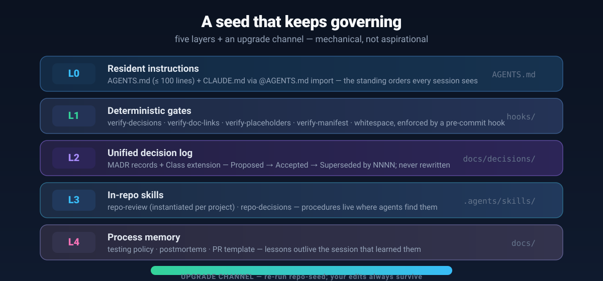
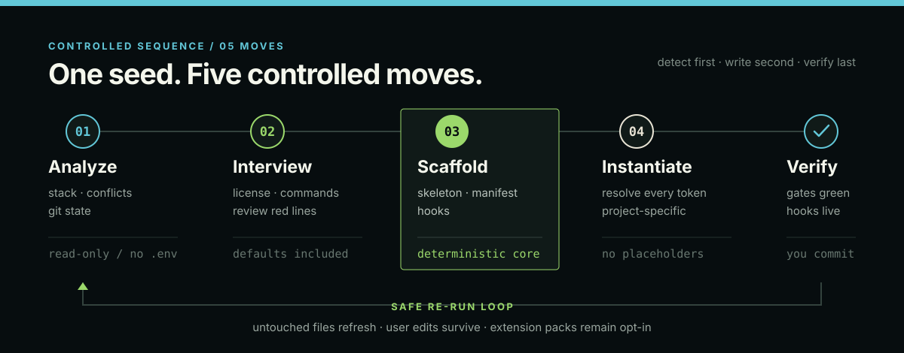

<div align="center">


<h1>repo-seed</h1>

**Make any repository agent-native — docs, decisions, gates & hooks, seeded in one pass.**

`repo-seed` is a cross-tool skill that turns a traditional repository — empty or existing, any stack — into a **self-governing, vibe-coding-ready** repository. It's a generator, not a template: deterministic scripts build the skeleton, the model instantiates the content, and an ownership manifest keeps the whole seed **upgradeable without ever overwriting your work**.

</div>

---

## Why repo-seed

AI assistants are only as good as the context you give them. Most repositories drift: docs rot, decisions get re-litigated, agents re-learn the project every session, and nothing mechanically stops a bad commit.

repo-seed fixes that with **mechanical governance, not more documents**:

- **Agents finally understand your repo** — one `AGENTS.md`, discovered by Claude Code, Codex, Cursor, Gemini CLI, opencode, Copilot & Synergy.
- **Decisions stop disappearing** — a unified MADR decision log that agents actually read.
- **Drift gets caught, not noticed late** — deterministic gates enforced by a pre-commit hook.
- **Your work is never overwritten** — the manifest remembers every seeded file; re-running refreshes only what you haven't touched.

## Quick start

```bash
# Install (any one):
ln -s /path/to/repo-seed ~/.agents/skills/repo-seed        # cross-tool path
ln -s /path/to/repo-seed ~/.claude/skills/repo-seed        # Claude Code
npx skills add EricSanchezok/repo-seed                     # Vercel skills

# In your target repo, say to your agent:
#   "initialize this repository with repo-seed"
```

Or run the generator directly (deterministic core, model fills content afterward):

```bash
node repo-seed/scripts/scaffold.mjs <target-dir> \
  --templates repo-seed/references/templates --dry-run     # preview first
```

**Requires:** Node ≥ 18 on the machine running the skill. Works with any language, framework, or monorepo.

## What you get: five layers + an upgrade channel



| Layer | What it does |
|---|---|
| **L0 · Resident instructions** | `AGENTS.md` (≤ 100 lines) + `CLAUDE.md` via `@AGENTS.md` import — standing orders every session sees |
| **L1 · Deterministic gates** | `verify-decisions` · `verify-doc-links` · `verify-placeholders` · `verify-manifest` · whitespace — enforced by a pre-commit hook |
| **L2 · Unified decision log** | MADR records + `Class:` extension — `Proposed → Accepted → Superseded by NNNN`, never rewritten |
| **L3 · In-repo skills** | `repo-review` (instantiated per project) · `repo-decisions` — procedures live where agents find them |
| **L4 · Process memory** | testing policy · postmortems · PR template — lessons outlive the session |
| **Upgrade channel** | `.repo-seed/manifest.json` records seeded-file hashes — re-run to refresh untouched files, keep yours |

## How it works



1. **Analyze** — detect stack, existing files at seeded paths, git state (read-only; never reads `.env`).
2. **Interview** — ask only what detection can't answer: license, commands, review red lines, extension packs. Every question has a default.
3. **Scaffold** — deterministic: directory skeleton, seeded files, manifest, hooks. Zero dependencies.
4. **Instantiate** — the model resolves every token into real content; no placeholder may ship.
5. **Verify** — gates green, hooks live; **you** review and commit — repo-seed never commits or pushes on its own.

Re-run any time to upgrade: untouched files refresh to the latest templates, **your edits survive by default**, and files you created are never deleted.

## Optional extension packs

**Core-minimal by default.** repo-seed ships six optional packs — none are enabled unless you choose them. A non-interactive run seeds only the 27-file core baseline.

| Pack | Adds | Choose when |
|---|---|---|
| `ci` | `.github/workflows/ci.yml` running gates + tests | any GitHub repo |
| `release` | conventional commits + commit-msg hook + release policy | repos that ship versions |
| `community` | `SECURITY.md` + `CODE_OF_CONDUCT.md` | public repos |
| `codeowners` | `CODEOWNERS` per-path owners | multi-owner repos |
| `spec` | lightweight spec lifecycle in `docs/specs/` | feature-heavy projects |
| `ai-disclosure` | AI participation policy (`Assisted-by:` trailer) | AI-assisted repos |

```bash
node repo-seed/scripts/scaffold.mjs <target-dir> \
  --templates repo-seed/references/templates \
  --extensions ci,release,community
```

Extensions can be added any time; removing a pack's files is always an explicit user action — never an automatic deletion.

## Repository layout

```
repo-seed/
├── SKILL.md                  skill entry (agentskills.io spec)
├── references/               templates/ · interview.md · decision-standard.md
│                             doc-standard.md · review-standard.md · update-strategy.md
├── scripts/                  scaffold.mjs · 4 verifiers · verify-commit-msg · install-hooks · tests
├── assets/                   hero.webp · governance.svg · workflow.svg
├── AGENTS.md  CLAUDE.md      this repo's own resident instructions (dogfood)
├── docs/                     decisions/ · specs/ · postmortems/ · policies
└── .agents/skills/           repo-review · repo-decisions (dogfood copies)
```

The repository **dogfoods its own standard**: its `AGENTS.md`, docs, decision log, gates, and hooks were generated by repo-seed itself and pass their own verifiers. 41 tests, 4 gates, all green.

## License

MIT. The generated `LICENSE` is also MIT by default; the interview can choose other options.
